# PhysioMeter User Guide

PhysioMeter is a free, open-source, client-side web application for scoring
and interpreting physical therapy outcome measures. All computation and data
storage happen in your browser; no patient information is transmitted to a
server.

This guide walks through the complete workflow on the Annual Mobility
Screening (AMS) preset: creating a patient, starting a session, administering
measurements, and reviewing the summary. The screenshots below are produced
by the end-to-end walkthrough test at `e2e/user-guide-walkthrough.spec.js`,
so they stay in sync with the deployed UI.

> **Safety notice.** PhysioMeter is a workflow and scoring aid, not a
> diagnostic device. Interpretations are computed from published thresholds
> and normative data — clinical judgment is required. Do not use PhysioMeter
> for decisions outside a licensed therapist's scope of practice.

## Contents

1. [Accessing PhysioMeter](#1-accessing-physiometer)
2. [Creating a patient](#2-creating-a-patient)
3. [The patient dashboard](#3-the-patient-dashboard)
4. [Starting a session](#4-starting-a-session)
5. [Administering the Annual Mobility Screen](#5-administering-the-annual-mobility-screen)
6. [Reading the summary](#6-reading-the-summary)
7. [Interpretation severities](#7-interpretation-severities)
8. [Exporting results](#8-exporting-results)
9. [Data persistence and privacy](#9-data-persistence-and-privacy)
10. [Reproducing the walkthrough](#10-reproducing-the-walkthrough)

---

## 1. Accessing PhysioMeter

PhysioMeter is deployed as a static site at
<https://niema-lab.github.io/PhysioMeter/>. No account, login, or
installation is required. Any modern evergreen browser (Chrome, Edge,
Firefox, Safari) with IndexedDB and JavaScript enabled is supported.

The landing page exposes four entry points: **New Patient**, **Existing
Patient**, **Presets** (reference list of available protocols), and
**Utilities** (stopwatches, countdown timers, and tallies available without a
session).

<p align="center">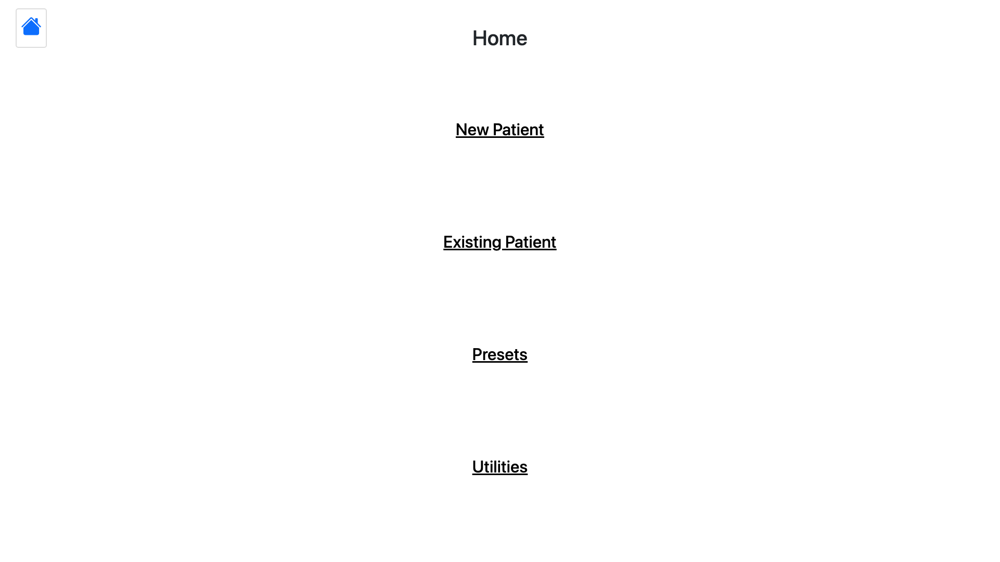</p>

## 2. Creating a patient

From the home page, click **New Patient**. Name is required; date of birth
and sex are optional but enable age- and sex-stratified interpretations
(mobility cutoffs, PCML/ML classification) to be computed.

<p align="center">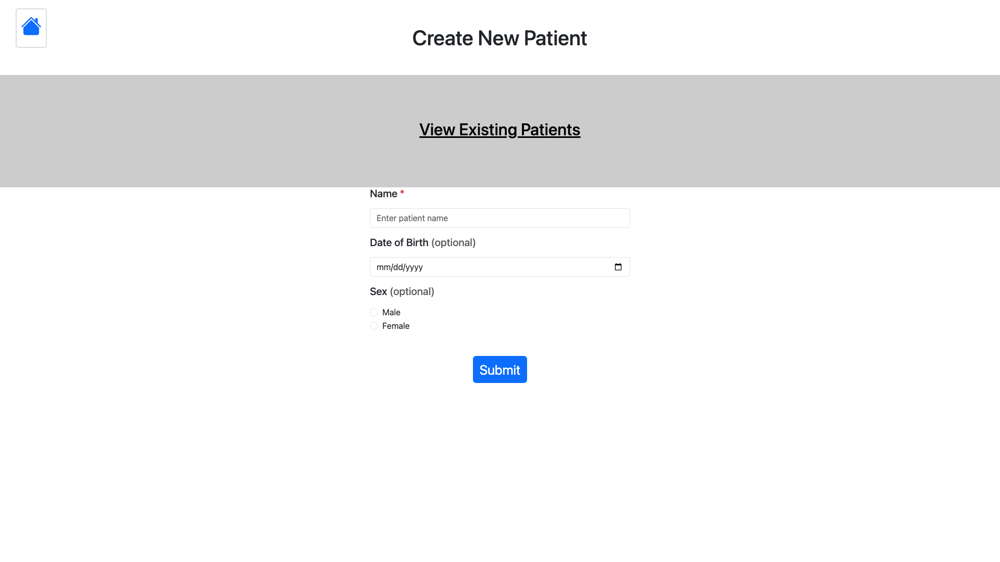</p>

Fill the patient's identifying information and click **Submit**.

<p align="center">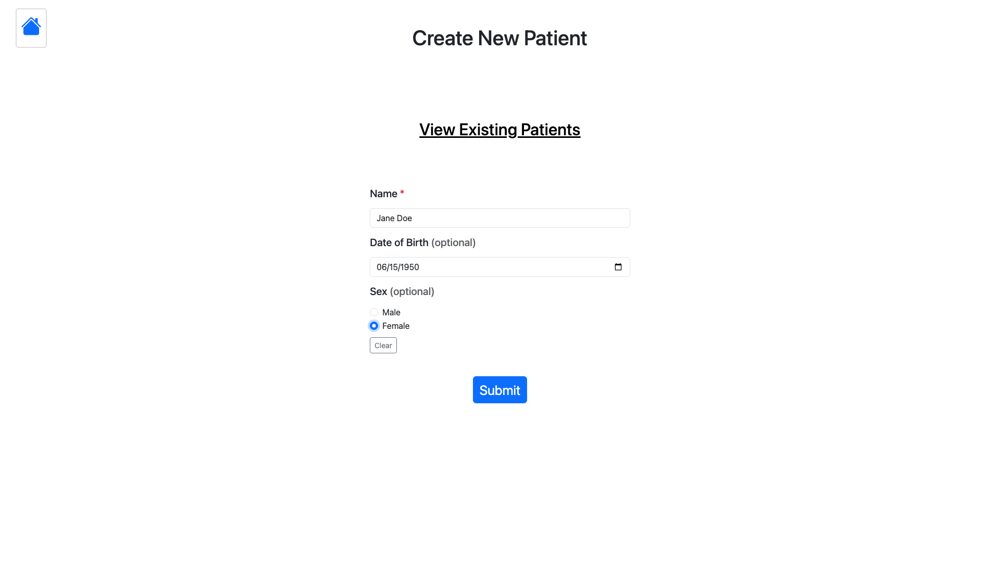</p>

A confirmation message appears once the record is written to IndexedDB.

<p align="center">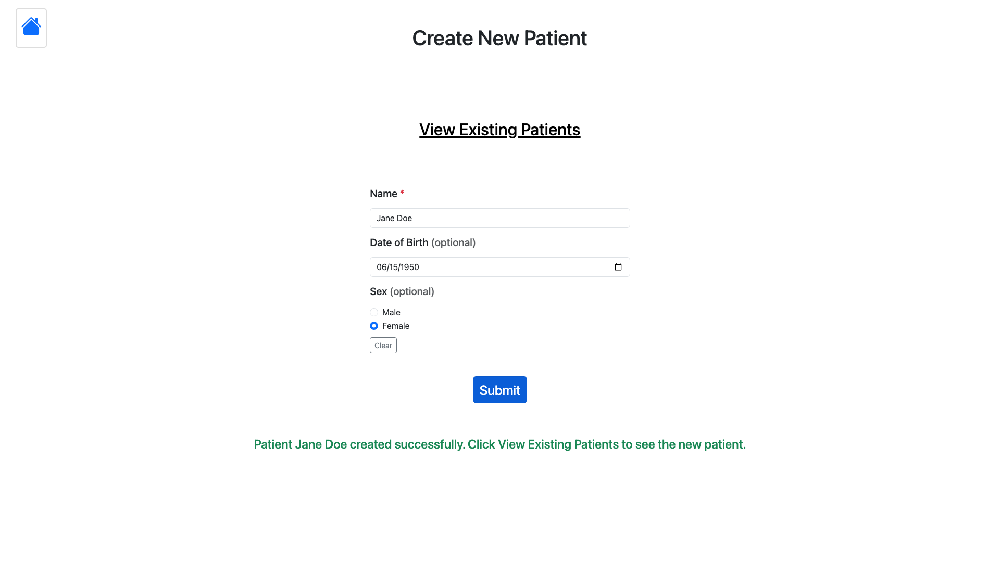</p>

Follow the **View Existing Patients** link to see all patients stored in
this browser.

<p align="center">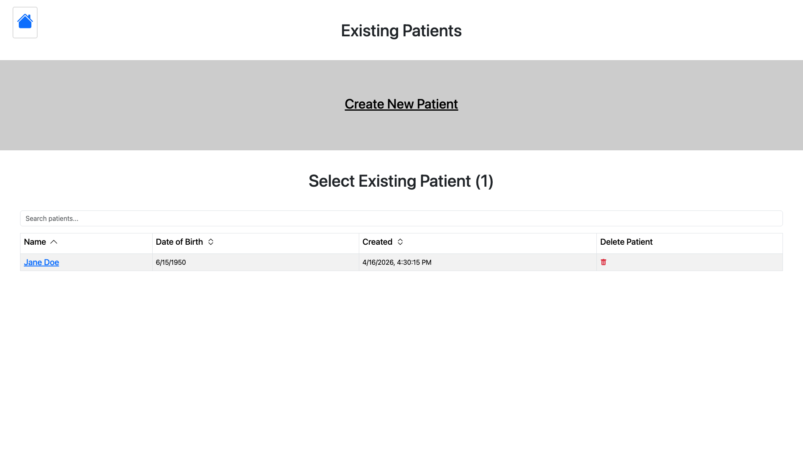</p>

## 3. The patient dashboard

Clicking a patient opens their dashboard: identifying info, an **Edit
Patient Info** link, a **New Session** button, and the table of existing
sessions. Each session row links into the measurement workflow at the
point it was last saved.

<p align="center">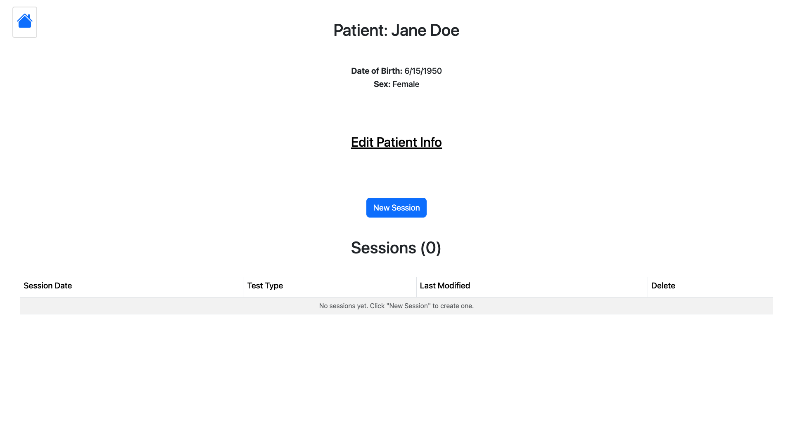</p>

## 4. Starting a session

**New Session** prompts for a session timestamp (defaults to now; can be
backdated) and a test type. Selecting the **Annual Mobility Screening**
preset restricts the measurement list to the nine measures that make up
that protocol in the order they should be administered. Selecting
**Measurements** gives access to every configured measurement.

<p align="center">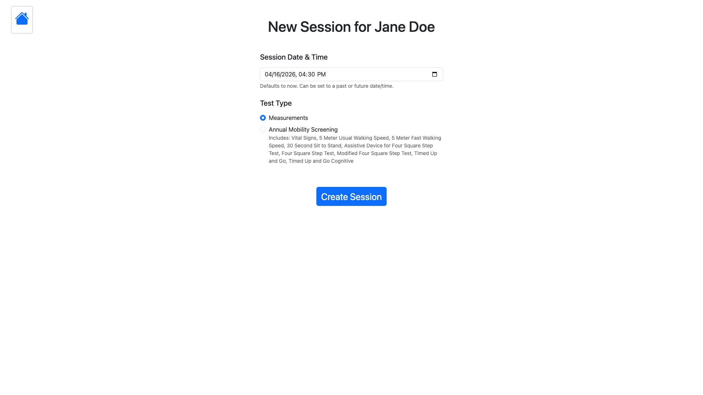</p>

<p align="center"></p>

Click **Create Session** to land on the session home.

## 5. Administering the Annual Mobility Screen

The session home shows the full ordered list of measurements for the
preset. Click **Proceed to Measurements** to step into the workflow; the
**Next Measurement** / **Previous Measurement** buttons (or the side-nav
icon) move between pages. Your session auto-saves to IndexedDB as you go.

<p align="center">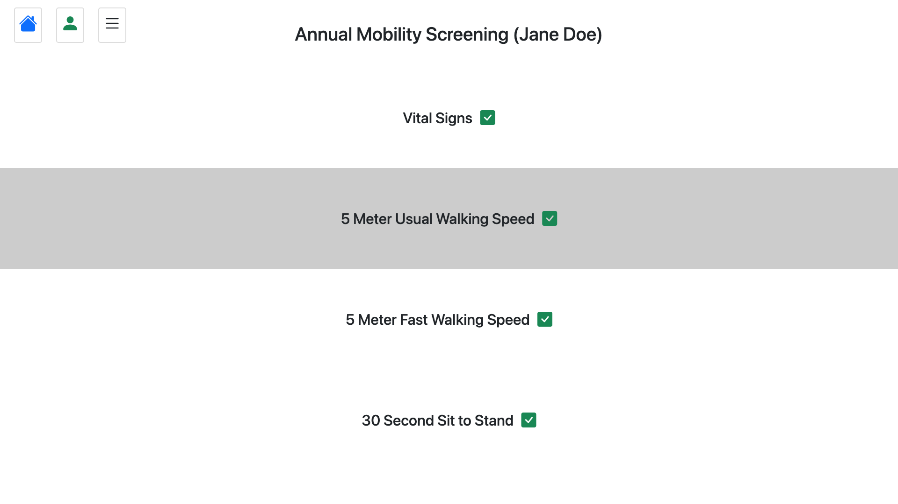</p>

### Vital Signs (safety screen)

Resting pulse, blood pressure (`systolic/diastolic`), and oxygen saturation
are administered first. If any value crosses an ineligibility threshold
(pulse > 100, SpO₂ < 90%, systolic > 180 or < 90, diastolic > 110 or < 60)
the vital signs interpretation flags the patient as ineligible for physical
activity and all downstream mobility tests are disabled with an override
checkbox.

<p align="center">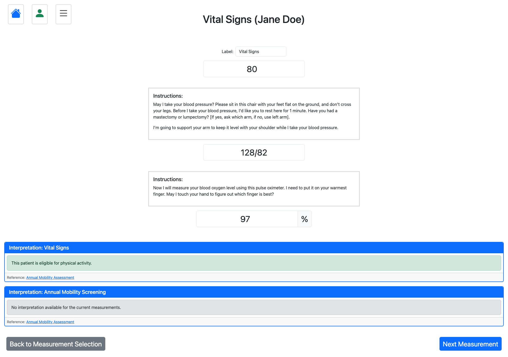</p>

Each measurement page shows the administration script (verbal instructions
and tester setup) above its input row, and renders interpretations inline
as soon as enough data is present.

### 5-Meter Walking Speed — usual and fast

Two trials per condition. Each trial row has a stopwatch with
**Start** / **Stop** / **Reset** controls and a manual `sec` input for
entering a previously timed value. Usual walking speed interpretation
uses the mean of the two trials; fast walking speed uses the best (fastest)
of the two.

<p align="center">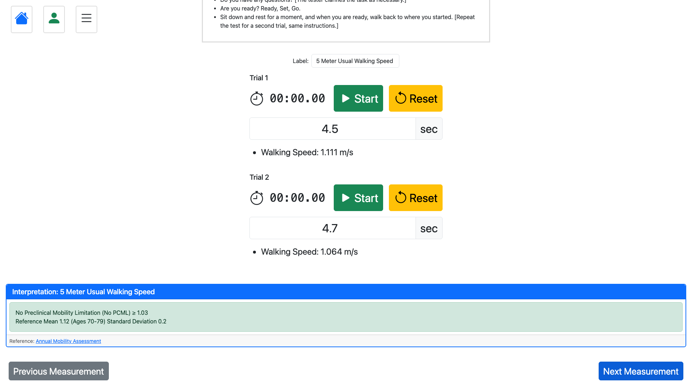</p>
<p align="center"></p>

### 30-Second Sit to Stand

Tap **Start** to begin the integrated 30-second countdown, then use the
`+` / `−` buttons (or type directly) to tally completed repetitions.

<p align="center">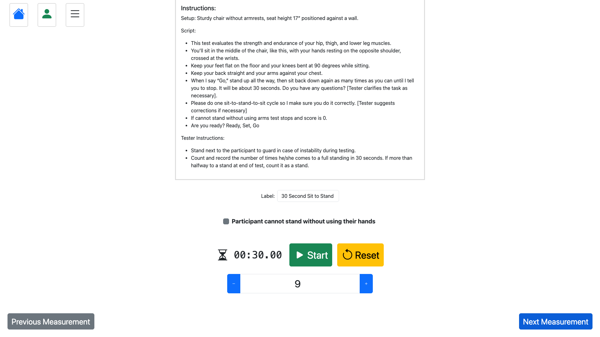</p>

### Assistive Device → Four Square Step Test routing

The assistive-device answer routes the FSST branch: **None** or
**Straight Cane** enables the standard FSST; any other device enables the
Modified FSST. Only the applicable variant is required.

<p align="center">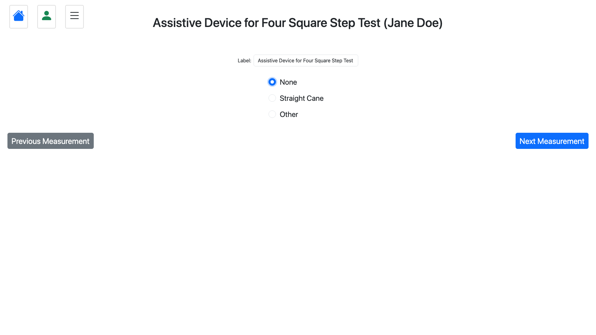</p>
<p align="center">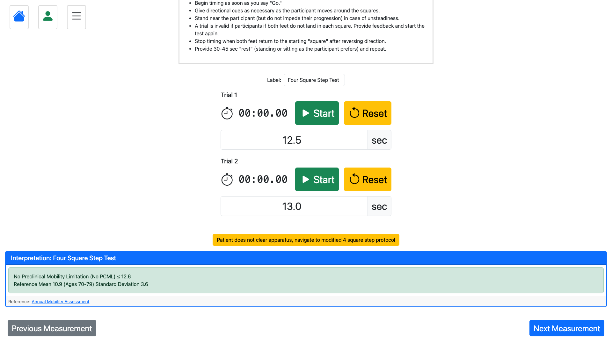</p>

### Timed Up and Go (TUG) and TUG Cognitive

Two trials for the standard TUG (best trial is used); a single trial with a
separate error count for the cognitive dual-task variant.

<p align="center">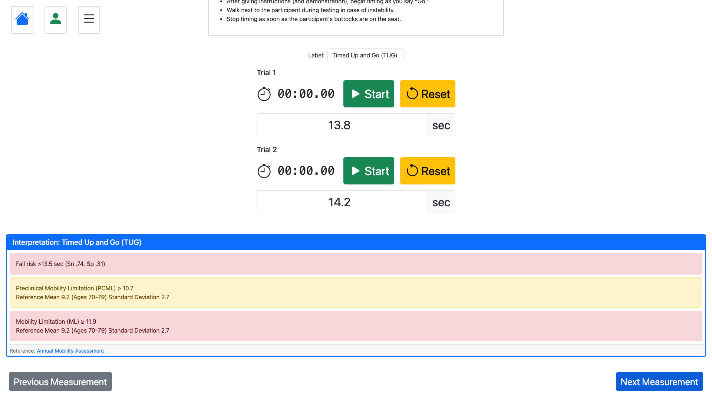</p>
<p align="center">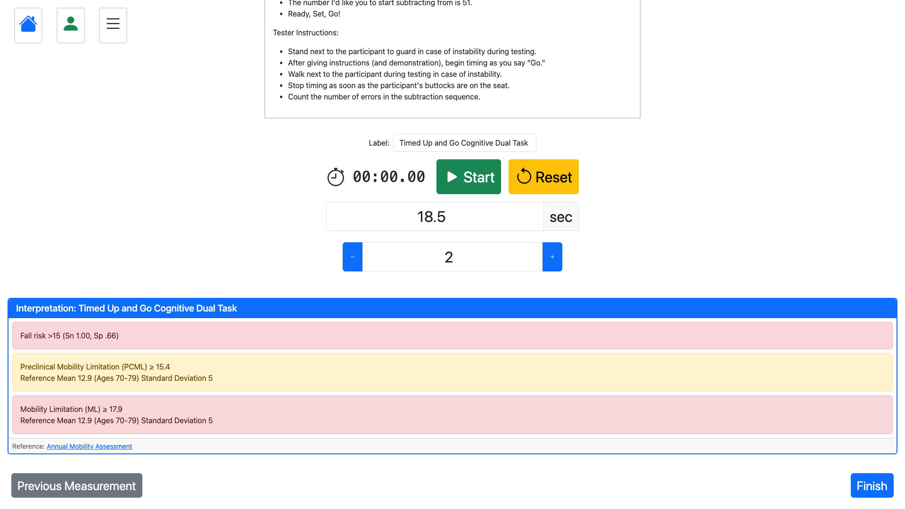</p>

## 6. Reading the summary

Click **Finish** on the last measurement (or **Summary** in the side-nav)
to open the summary page. It lists patient info, the raw measurements,
every calculation, and every interpretation for the session.

<p align="center">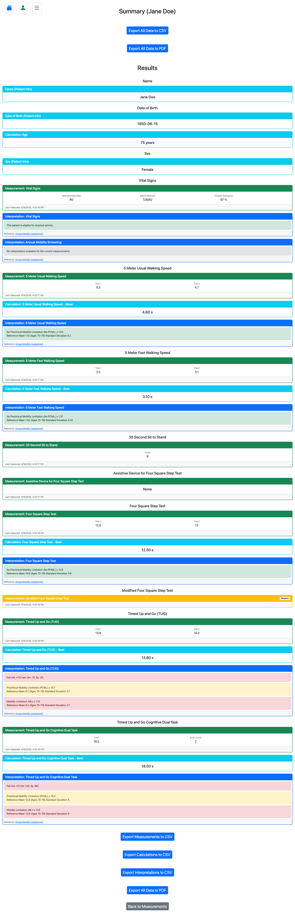</p>

## 7. Interpretation severities

Interpretations are color-coded:

| Color  | Meaning                                                    |
| ------ | ---------------------------------------------------------- |
| Green  | Normal — value within expected range                        |
| Yellow | Caution — below population norm but not a risk threshold    |
| Red    | Concern — crosses a published risk or ineligibility cutoff |
| Gray   | Insufficient data or not applicable (e.g. missing DOB/sex) |

Each interpretation includes a literature citation link. If demographics
(age, sex) are missing, age- and sex-stratified interpretations show
"insufficient data" rather than guessing.

## 8. Exporting results

The summary page provides export buttons for **CSV** (raw data for
spreadsheets and EHR paste) and **PDF** (a printable report). Exports happen
entirely in the browser; nothing is uploaded.

## 9. Data persistence and privacy

- All patient records, sessions, and measurements live in the browser's
  **IndexedDB** (database `PTAppDB`, store `users`).
- No data is transmitted off the device. The app has no backend, no
  authentication, and no analytics.
- Data is tied to the browser profile on the device. Clearing browser
  storage, using a different browser, or switching devices will not carry
  the data over. Use the **Export CSV/PDF** buttons on the summary if you
  need to preserve results outside the app.
- Each patient's sessions can be deleted from the patient dashboard; each
  patient can be deleted from the Existing Patients list.

## 10. Reproducing the walkthrough

The screenshots in this guide are regenerated by a Playwright test:

```bash
npx playwright test                 # run the walkthrough (also serves as e2e coverage)
npx playwright test --headed        # watch it run in a real browser
```

The test lives at `e2e/user-guide-walkthrough.spec.js` and writes PNGs to
`docs/user-guide-images/`. The Playwright config (`playwright.config.js`)
auto-starts `npm run dev` on port 5173. To regenerate screenshots after a
UI change, re-run the test and commit the updated images alongside any
guide edits.
